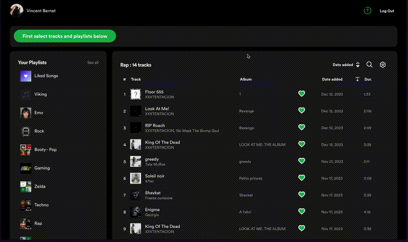

# Track-it

[](https://app.netlify.com/sites/track-it-v1/deploys)



## Presentation

Welcome to Track-It, a music organiser to agregate all of your collection and manage it as you wish.
Currently Track-It works as a plugin of spotify, where you can organize your tracks by playlist in an simplier way.
Here you can, test :

- Consult all of your librairy (tracks and playlist) in a global view
- Add your tracks to your playlists in one click (one or many tracks to one or many playlist)
- Get recommandations on your tracks
- Filter, sort and search your tracks
- Bonus : get your top tracks, top artists and other funny data.

Roadmap :

- Complete personalization with parametrage of your librairy and possibility to add customs tags to your tracks.
- Generate and modify playlist with rules related to current tracks data and / or your custom tags.

## Stack & deployment

- Mono-repo (everything in typescript)
- Backend : Using Express, deployed on Heroku: https://dashboard.heroku.com/login
- Frontend : Using React with Vite, deployed on Netlify: https://app.netlify.com/sites/track-it-v1/overview
- Biome as unique formater and linter
- All icons are from : www.svgrepo.com
- Each push on production branch trigger a deployment on both front and backend

## Set-up

Require Node.js version > 20.0.0
<br>
Firt pull the project where you want:

```
git clone https://github.com/VincentBernet/Track-It
```

Go in the Track-It folder, then install both back and front in one command:

```
cd Track-It
npm install
```

And start the project in one command again:

```
npm start
```

Open the localhost url shown in your terminal (something like : http://localhost:5173/)
<br>
Ready to dev 🚀 Was easy right 😊 ?
